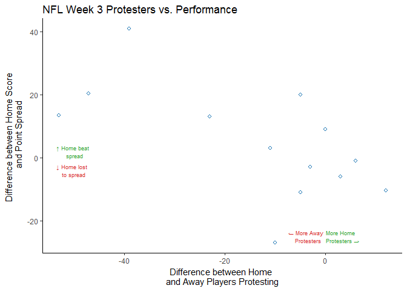
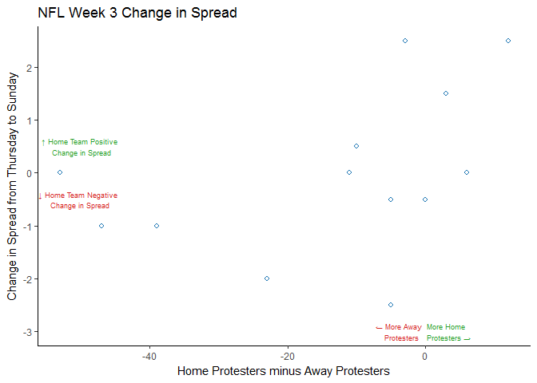
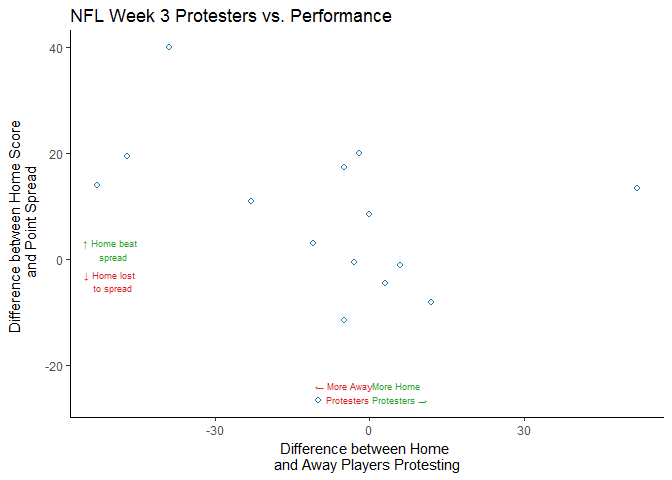
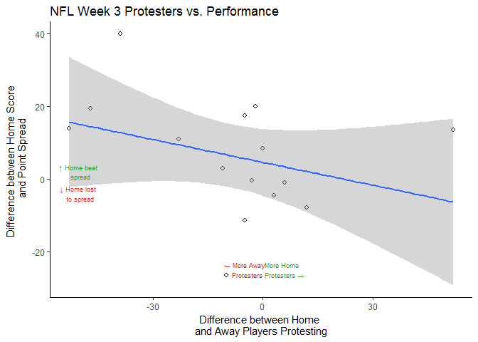

Last week, President Trump gave an explicit-laden speech at a rally in Alabama where he suggested NFL players should be fired for taking a knee in protest during the national anthem. The response from NFL players was vast - over 200 players protested this weekend.

<br>

Yesterday John R. Lott, president of the right-leaning Crime Prevention Research Center, published an article in Fox News outlining his statistical research of these protests. He concluded there was a “large and statistically significant” relationship between the number of players protesting and the performance of the team during Week 3 of the 2017 NFL season. Mr. Lott was kind enough to publish the data he used and his regression results. In this article, I will examine Mr. Lott’s analysis and provide my own take. This will not be a post about the merits of protesting the national anthem, but one about statistical significance.

<br>

Tl;dr; the relationship is not statistically significant. Mr. Lott’s analysis contains many statistical fallacies.

``` r
library(tidyverse)
library(readstata13)
```

<br> The data Mr. Lott provided contained games from Week 3 of the NFL season. It detailed the number of protesters for each team, score of each game, and the betting line of each game as of Thursday and as of Sunday.

``` r
df <- readstata13::read.dta13("./data/NFL_Games_Kneeling.dta")
head(df)
```

    ##   game    team1 team1score team1kneelers    team2 team2score team2kneelers
    ## 1    1  Raiders         10            50 Redskins         27             3
    ## 2    2   Ravens          7            51  Jaguars         44            12
    ## 3    3  Broncos         16            32     Bill         26             9
    ## 4    4 Steelers         17             0    Bears         23             0
    ## 5    5  Falcons         30             2    Lions         26             8
    ## 6    6   Browns         28            20    Colts         31             9
    ##   differencet2sminust1s thursdaypointspread sundaypointspread
    ## 1                    17                -3.5              -2.5
    ## 2                    37                -4.0              -3.0
    ## 3                    10                -3.0              -1.0
    ## 4                     6                -7.5              -7.5
    ## 5                    -4                -3.0              -3.0
    ## 6                     3                 0.0               0.0
    ##   team1lockerroom team2lockerroom difference2kminus1k
    ## 1               0               0                 -47
    ## 2               0               0                 -39
    ## 3               0               0                 -23
    ## 4               1               0                   0
    ## 5               0               0                   6
    ## 6               0               0                 -11
    ##   difference2LRminus1LR difscoreminusdifpointspread
    ## 1                     0                        20.5
    ## 2                     0                        41.0
    ## 3                     0                        13.0
    ## 4                    -1                        13.5
    ## 5                     0                        -1.0
    ## 6                     0                         3.0
    ##   DifNumberPlayersProtesting
    ## 1                        -47
    ## 2                        -39
    ## 3                        -23
    ## 4                        -53
    ## 5                          6
    ## 6                        -11

``` r
# I found the column names to be difficult to interpret, so I have renamed them.
colnames(df) <- c('game', 'away_team', 'away_team_score', 'away_team_kneelers', 'home_team', 'home_team_score', 
                  'home_team_kneelers', 'home_minus_away_score', 'thurs_spread', 'sun_spread', 'away_lockeroom', 
                  'home_locker_room', 'net_home_kneelers', 'net_home_lockeroom', 'difference_score_minus_spread', 
                  'difference_number_players_protesting')


# the way they recorded spreads is quite peculiar. Usually the home team is labeled with a negative if they're favored.
# I adjusted to make the data more readable.
df$sun_spread <- df$sun_spread * -1
df$thurs_spread <- df$thurs_spread * -1

df
```

    ##    game  away_team away_team_score away_team_kneelers home_team
    ## 1     1    Raiders              10                 50  Redskins
    ## 2     2     Ravens               7                 51   Jaguars
    ## 3     3    Broncos              16                 32      Bill
    ## 4     4   Steelers              17                  0     Bears
    ## 5     5    Falcons              30                  2     Lions
    ## 6     6     Browns              28                 20     Colts
    ## 7     7 Buccaneers              17                  2   Vikings
    ## 8     8     Texans              33                  0  Patriots
    ## 9     9   Dolphins               6                  5      Jets
    ## 10   10     Giants              24                  3    Eagles
    ## 11   11     Saints              34                 10  Panthers
    ## 12   12   Seahawks              27                  0    Titans
    ## 13   13    Bengals              24                  0   Packers
    ## 14   14     Chiefs              24                 10  Chargers
    ##    home_team_score home_team_kneelers home_minus_away_score thurs_spread
    ## 1               27                  3                    17          3.5
    ## 2               44                 12                    37          4.0
    ## 3               26                  9                    10          3.0
    ## 4               23                  0                     6          7.5
    ## 5               26                  8                    -4          3.0
    ## 6               31                  9                     3          0.0
    ## 7               34                  0                    17           NA
    ## 8               36                 12                     3        -13.5
    ## 9               20                  0                    14          6.0
    ## 10              27                  0                     3         -6.0
    ## 11              13                  0                   -21         -6.0
    ## 12              33                  0                     6          3.0
    ## 13              27                  3                     3         -9.0
    ## 14              10                  5                   -14          3.0
    ##    sun_spread away_lockeroom home_locker_room net_home_kneelers
    ## 1         2.5              0                0               -47
    ## 2         3.0              0                0               -39
    ## 3         1.0              0                0               -23
    ## 4         7.5              1                0                 0
    ## 5         3.0              0                0                 6
    ## 6         0.0              0                0               -11
    ## 7         3.0              0                0                -2
    ## 8       -11.0              0                0                12
    ## 9         3.5              0                0                -5
    ## 10       -3.5              0                0                -3
    ## 11       -5.5              0                0               -10
    ## 12        2.5              1                1                 0
    ## 13       -7.5              0                0                 3
    ## 14        2.5              0                0                -5
    ##    net_home_lockeroom difference_score_minus_spread
    ## 1                   0                          20.5
    ## 2                   0                          41.0
    ## 3                   0                          13.0
    ## 4                  -1                          13.5
    ## 5                   0                          -1.0
    ## 6                   0                           3.0
    ## 7                   0                            NA
    ## 8                   0                         -10.5
    ## 9                   0                          20.0
    ## 10                  0                          -3.0
    ## 11                  0                         -27.0
    ## 12                  0                           9.0
    ## 13                  0                          -6.0
    ## 14                  0                         -11.0
    ##    difference_number_players_protesting
    ## 1                                   -47
    ## 2                                   -39
    ## 3                                   -23
    ## 4                                   -53
    ## 5                                     6
    ## 6                                   -11
    ## 7                                    -2
    ## 8                                    12
    ## 9                                    -5
    ## 10                                   -3
    ## 11                                  -10
    ## 12                                    0
    ## 13                                    3
    ## 14                                   -5

<br>

### The Initial Regression Model

The analysis contains a linear regression model. This model aimed to predict a metric which compared the home team’s performance vs. the spread. If a home team was favored by 7 but won by 10, this metric would result in 3. The model used a variable which compared the difference in the number of protesting from the away team and the home team. If the home team had 20 protesting players and the away team had 10, this metric would be -10.

<br>

My replication of the model in R produced the following results:

``` r
model <- lm(df$difference_score_minus_spread ~ df$difference_number_players_protesting)
summary(model)
```

    ## 
    ## Call:
    ## lm(formula = df$difference_score_minus_spread ~ df$difference_number_players_protesting)
    ## 
    ## Residuals:
    ##     Min      1Q  Median      3Q     Max 
    ## -29.928  -2.283  -1.696   4.404  22.970 
    ## 
    ## Coefficients:
    ##                                         Estimate Std. Error t value
    ## (Intercept)                              -2.2793     4.7871  -0.476
    ## df$difference_number_players_protesting  -0.5207     0.1988  -2.619
    ##                                         Pr(>|t|)  
    ## (Intercept)                               0.6433  
    ## df$difference_number_players_protesting   0.0239 *
    ## ---
    ## Signif. codes:  0 '***' 0.001 '**' 0.01 '*' 0.05 '.' 0.1 ' ' 1
    ## 
    ## Residual standard error: 14.31 on 11 degrees of freedom
    ##   (1 observation deleted due to missingness)
    ## Multiple R-squared:  0.3841, Adjusted R-squared:  0.3281 
    ## F-statistic: 6.861 on 1 and 11 DF,  p-value: 0.02386

<br>

This model contains an R-squared value of .38. This number should be interpreted as 38% of the home team’s performance vs. the spread can be explained by the difference in the number of protesting players from each team. The p-value of this metric is .02. The standard rule of thumb for statistical significance is this p-value should be a maximum of .05 (lower p-values mean greater statistical significance). For this reason, Mr. Lott states his result is statistically significant.

<br>

### Visual Analysis

<br>

When conducting a simple regression analysis (an analysis with a single predictor), it is always important to visualize your data.

``` r
ggplot(data = df, aes(x =  difference_number_players_protesting, y = difference_score_minus_spread)) +
  geom_point(shape=21, color='#1f77b4', fill='white', size =1.5, stroke=1) +
  ylab("Difference between Home Score \n and Point Spread") +
  xlab("Difference between Home \nand Away Players Protesting") +
  ggtitle('NFL Week 3 Protesters vs. Performance', ) +
  theme_classic() +
  annotate("text", x = -50, y = 2, size = 2.5,color = '#2ca02c' , label = paste( sprintf('\u2191'),'Home beat \n spread')) +
  annotate("text", x = -50.2, y = -4, size = 2.5,color = '#d62728', label = paste(sprintf('\u2193'), 'Home lost \n to spread')) +
  annotate("text", x = -3.7, y = -25, size = 2.5, color = '#d62728', label = paste(sprintf('\u2190'), 'More Away \n Protesters')) +
  annotate("text", x = 3.2, y = -25, size = 2.5,color = '#2ca02c', label = paste( 'More Home \n Protesters',sprintf('\u2192'))) 
```

    ## Warning: Removed 1 rows containing missing values (geom_point).



<br>

When looking at this data, you can see there is a slight downward trend, but it’s not exactly a linear relationship and a regression line would not fit the data tightly.

<br>

### Statistical Fallacies

<br>

The first statistical fallacy committed in this analysis is the target variable (home team performance relative to the spread). In this analysis, Mr. Lott states.

<br>

“ We used Thursday’s point spread, the day before Trump’s first remarks, to predict how the teams were likely to play in Sunday’s games. The reason for doing it before Friday is that the bettors might have had some idea how the conflicts created by Trump might have affected the team’s performances so that it would already be in the change in the spread by Sunday.”

<br>

On the surface this seems like a perfectly reasonable choice.

``` r
df$sun_difference <- df$home_minus_away_score + df$sun_spread
df$spread_difference <- df$sun_spread - df$thurs_spread

ggplot(data=df, aes(x = difference_number_players_protesting, y  = spread_difference)) + 
  geom_point(shape=21, color='#1f77b4', fill='white', size =1.5, stroke=1) + 
  xlab('Home Protesters minus Away Protesters') + 
  ylab('Change in Spread from Thursday to Sunday') +
  ggtitle('NFL Week 3 Change in Spread') +
  theme_classic() +
  annotate("text", x = -50, y = .5, size = 2.5,color = '#2ca02c' , label = paste( sprintf('\u2191'),'Home Team Positive \n Change in Spread')) +
  annotate("text", x = -50.2, y = -.5, size = 2.5,color = '#d62728', label = paste(sprintf('\u2193'), 'Home Team Negative \n Change in Spread')) +
  annotate("text", x = -3.7, y = -3, size = 2.5, color = '#d62728', label = paste(sprintf('\u2190'), 'More Away \n Protesters')) +
  annotate("text", x = 3.2, y = -3, size = 2.5,color = '#2ca02c', label = paste( 'More Home \n Protesters',sprintf('\u2192')))
```

    ## Warning: Removed 1 rows containing missing values (geom_point).



<br>

This chart demonstrates a few interesting items. The team with the largest difference in protesting players vs. their opponents, the Pittsburgh Steelers, experienced no change in betting line. Many players who protested did not announce their intention to protest prior to the game, so there would have been no way for the odds makers to take these protests into account when setting a line.

<br>

Two other (and in my personal opinion, more relevant) reasons an NFL betting line will change from Thursday to Sunday are injuries and bets placed. NFL teams closely guard information on which players will be available for games, and this information is frequently not made public until Sunday. If a key player is ruled out, the line can shift a point or two on Sunday morning. Additionally, betting lines can shift due to the number of bets placed. If one team is getting a disproportionate amount of bets, the line will shift away from that team.

<br>

The most egregious statistical fallacy in this analysis is sample size. This model is fit on just thirteen data points. This is a dangerously small sample size, and one that leads to unstable models due to its extreme sensitivity to each individual data point. At no point in Mr. Lott’s analysis did he present this shortcoming to his readers, although as a PhD in Econ, he is most certainly aware of it.

<br> \#\#\# Selecting an Appropriate Target Variable <br>

NFL buffs reading this might have already recognized that there were in fact more than 13 games played this past week. This statistical model has removed Tampa Bay-Minnesota game was removed due to a lack of Thursday betting data.

<br>

When conducting a regression analysis on a sample size as small as this, the modeler should avoid removing data points at all costs. For this reason, the Sunday betting lines should be the target variable. The chart in the previous section demonstrated there was no relationship between the number of protesting players and a shift in betting line.

<br>

Tampa Bay had two protesting players while Minnesota had none. Tampa Bay lost by 17 points even though they were favored by 3. Intuitively, one might think this would support Mr. Lott’s conclusion that more protesting players lead to a worse performance. When I use the Sunday betting line as a target variable, the model gets considerably weaker:

``` r
model <- lm(df$sun_difference ~ df$difference_number_players_protesting)
summary(model)
```

    ## 
    ## Call:
    ## lm(formula = df$sun_difference ~ df$difference_number_players_protesting)
    ## 
    ## Residuals:
    ##     Min      1Q  Median      3Q     Max 
    ## -31.103  -3.155  -1.815   6.668  22.421 
    ## 
    ## Coefficients:
    ##                                         Estimate Std. Error t value
    ## (Intercept)                               0.1287     4.5636   0.028
    ## df$difference_number_players_protesting  -0.4475     0.1966  -2.276
    ##                                         Pr(>|t|)  
    ## (Intercept)                                0.978  
    ## df$difference_number_players_protesting    0.042 *
    ## ---
    ## Signif. codes:  0 '***' 0.001 '**' 0.01 '*' 0.05 '.' 0.1 ' ' 1
    ## 
    ## Residual standard error: 14.32 on 12 degrees of freedom
    ## Multiple R-squared:  0.3014, Adjusted R-squared:  0.2432 
    ## F-statistic: 5.178 on 1 and 12 DF,  p-value: 0.04201

<br>

The R-squared here drops to.30, and the p-value increases to.042, approaching the maximum to be considered statistically significant. This demonstrates how volatile and unstable a regression model on 14 data points is.

<br>

### What about America's Team?

<br>

No statistical analysis involving the national anthem in the NFL would be complete without the Dallas Cowboys. The Dallas-Arizona game was played on Monday night, and I’m guessing Mr. Lott had completed his analysis prior to this game being completed. The entire Dallas Cowboys team took a knee on the field prior to the national anthem in a show of unity. While this was not technically during the anthem, the decision to do this would be equally distracting to a team’s preparation as kneeling during the actual anthem. For this reason, I included all 53 Dallas Cowboys as protesting players. Their opponents, the Arizona Cardinals locked arms, but they did not kneel in protest. When adding this single data point, the model completely falls apart:

``` r
# I manually added in data for Cowboys @ Cardinals
df <- read_csv('./data/nfl_games_kneeling_cowboys.csv')
```

``` r
model <- lm(df$sun_difference ~ df$difference_number_players_protesting)
summary(model)
```

    ## 
    ## Call:
    ## lm(formula = df$sun_difference ~ df$difference_number_players_protesting)
    ## 
    ## Residuals:
    ##     Min      1Q  Median      3Q     Max 
    ## -33.183  -7.086  -1.699   8.462  27.236 
    ## 
    ## Coefficients:
    ##                                         Estimate Std. Error t value
    ## (Intercept)                               4.5859     4.2611   1.076
    ## df$difference_number_players_protesting  -0.2097     0.1630  -1.286
    ##                                         Pr(>|t|)
    ## (Intercept)                                0.301
    ## df$difference_number_players_protesting    0.221
    ## 
    ## Residual standard error: 15.64 on 13 degrees of freedom
    ## Multiple R-squared:  0.1129, Adjusted R-squared:  0.04463 
    ## F-statistic: 1.654 on 1 and 13 DF,  p-value: 0.2209

<br>

The R-square has dropped to .11, and the p-value of our predicting variable has increased to .22, well above the threshold to be considered statistically significant. A single data point that does not support the original conclusion derailed Mr. Lott’s “statistically significant” relationship.

<br>

### Conclusion

<br>

When articles such as this are published, it is always important to review the methodology used before considering the conclusion. I applaud Mr. Lott for publishing the data and regression results in the name of transparency, and I hope this response can lead to a larger discussion about responsible statistics in journalism.

<br>

Mr. Lott is guilty of an unfortunately common practice in statistics, p-value fishing. He had too small of a sample to even consider a target variable that would reduce the amount of data in the analysis. He did not make readers aware of just how unstable and sensitive his model was to new data points. His statement that the impact of protesting was “large and statistically significant” was meant to deceive. The choices to limit the sample size were not disclosed in the article op-ed, but only in the statistical methodology section.

<br>

Unfortunately, the editors at Fox News has completely let the public down. They did not conduct any basic statistical review or scrutiny and allowed this statistically invalid analysis to be circulated.

``` r
ggplot(data = df, aes(x =  difference_number_players_protesting, y = sun_difference)) +
  geom_point(shape=21,  color='#1f77b4', fill='white', size =1.5, stroke=1) +
  ylab("Difference between Home Score \n and Point Spread") +
  xlab("Difference between Home \nand Away Players Protesting") +
  ggtitle('NFL Week 3 Protesters vs. Performance') +
  theme_classic() +
  annotate("text", x = -50, y = 2, size = 2.5,color = '#2ca02c' , label = paste( sprintf('\u2191'),'Home beat \n spread')) +
  annotate("text", x = -50.2, y = -4, size = 2.5,color = '#d62728', label = paste(sprintf('\u2193'), 'Home lost \n to spread')) +
  annotate("text", x = -4.5, y = -25, size = 2.5, color = '#d62728', label = paste(sprintf('\u2190'), 'More Away \n Protesters')) +
  annotate("text", x = 5.5, y = -25, size = 2.5,color = '#2ca02c', label = paste( 'More Home \n Protesters',sprintf('\u2192'))) 
```



``` r
ggplot(data = df, aes(x =  difference_number_players_protesting, y = sun_difference)) +
  geom_point(shape=21,  fill='white', size =1.5, stroke=1) +
  geom_smooth(method = 'lm') +
  ylab("Difference between Home Score \n and Point Spread") +
  xlab("Difference between Home \nand Away Players Protesting") +
  ggtitle('NFL Week 3 Protesters vs. Performance') +
  theme_classic() +
  annotate("text", x = -50, y = 2, size = 2.5,color = '#2ca02c' , label = paste( sprintf('\u2191'),'Home beat \n spread')) +
  annotate("text", x = -50.2, y = -4, size = 2.5,color = '#d62728', label = paste(sprintf('\u2193'), 'Home lost \n to spread')) +
  annotate("text", x = -4.5, y = -25, size = 2.5, color = '#d62728', label = paste(sprintf('\u2190'), 'More Away \n Protesters')) +
  annotate("text", x = 5.5, y = -25, size = 2.5,color = '#2ca02c', label = paste( 'More Home \n Protesters',sprintf('\u2192'))) 
```


